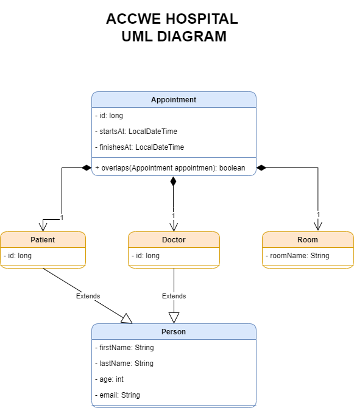

# Accwe Hospital

## Sobre el proyecto
El proyecto consiste en la modernización y mejora del sistema de control de citas del Hospital AccWe en respuesta a recientes ataques informáticos en hospitales de la zona.

El proyecto expone una Api Rest para el servicio de creación de citas, doctores, pacientes y salas (Appointment, Doctors, Patients, Rooms) y una configuración para realizar el deploy por medio de docker.

### Diagrama UML

## Requisitos previos

El presente proyecto está desarrollado con el lenguaje de programación JAVA usando la versión 8, para la correcta ejecución debe tener instalado los siguientes componentes.
- Un entorno de desarrollo o editor de código (IntelliJ IDEA, NetBeans, Visual Studio Code, etc).
- Git para clonar el repositorio o descargarlo en su defecto.
- Java 8 o superior
- Maven
- Docker

## Ejecución del Proyecto

1. Clona el repositorio: `git clone https://github.com/nuwe-reports/654285dbc093cfcbcf01056f.git`
2. Navega al directorio del proyecto: `cd ubicacionDelProyecto/654285dbc093cfcbcf01056f`
3. Ejecuta las imágenes de Docker:  `docker build -t nombre-de-la-imagen-mysql -f DockerFile.mysql .` y `docker build -t nombre-de-la-imagen-app -f DockerFile.maven .`
4. Ejecuta los contenedores de Docker: `docker run -d nombre-de-la-imagen-mysql:latest` y `docker run -d -p 8080:8080 nombre-de-la-imagen-app`

## EndPoints habilitadas

[Coleción de Postman con las diferentes EndPoints](Accwe-hospital.postman_collection.json)

Links de descargas:
- 💻 [ IntelliJ IDEA ](https://www.jetbrains.com/es-es/idea/download/#section=windows)
- [ Git ](https://git-scm.com/downloads)
- [ Docker ](https://www.docker.com/get-started/)
